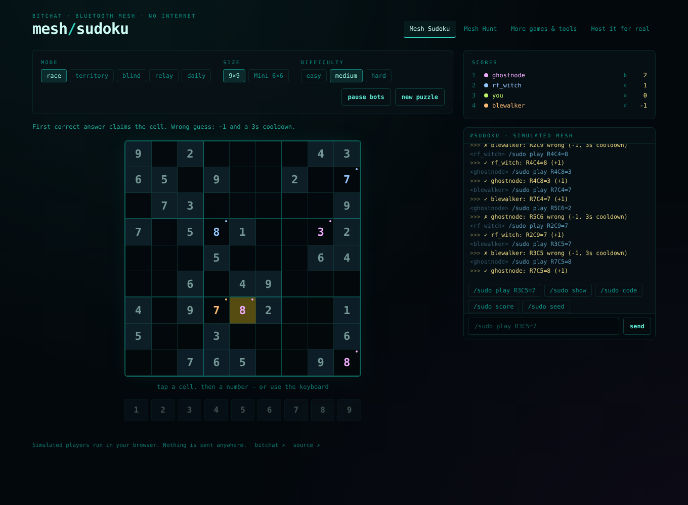

# Sudoku-variant

**Sudoku and other text games built for the [bitchat](https://github.com/permissionlesstech/bitchat) Bluetooth mesh.**
Play the browser simulators against bots, then host the same games for real over bitchat. No internet, no server.

**▶ Play in your browser:** https://themimitproject.github.io/Sudoku-variant/



Every game action is one short text message, turn-based phases absorb multi-hop delay, and nothing needs a server.
The rules engine that runs the simulators is the same code the host CLI uses, so what you try in the browser is
exactly what runs on the mesh.

---

## What's inside

### Mesh Sudoku (the main event)

| Mode | How it plays |
| --- | --- |
| **Race** | First correct answer claims the cell (+1). A wrong guess costs 1 point and a 3-second cooldown. |
| **Territory** | Race rules, plus whoever claimed the most cells in a box when it fills captures it for +3. |
| **Blind** (co-op) | The givens are dealt out between players; everyone else's show as `?`. Trade them with `/sudo pass`. |
| **Relay** (teams) | Teams of three. Each player owns one band of rows and only sees its givens. Fastest team wins. |
| **Mini** | Any mode on a 6×6 grid (2×3 boxes). The whole board is a 36-character code. |
| **Daily Mesh Puzzle** | Same puzzle for everyone in range today, no host. Post your time with a proof hash anyone can check. |

Every puzzle has **exactly one solution** (the generator checks), so "first correct answer wins" is always fair.

### More games

- **Mesh Hunt** — social deduction. Find the Jammer before the mesh collapses. 7+ players adds a Booster and a Scanner.
- **Mesh Battleship** — two players; fleets are committed by hash up front and audited at the end, so lying is caught.
- **Minesweeper Co-op** — one shared board, one action per player per turn, three lives.
- **Nonogram Race** — picture logic with Mesh Sudoku's claim-a-cell scoring. Puzzles are line-solvable (unique).
- **Word Grid** — Boggle-style. Only "found a 5-letter word" is announced live; duplicates cancel at the end.

### Mesh tools (not games)

- **Mesh Poll** — quick group decisions with optional auto-close.
- **Check-in Board** — safe / needs help / en route roster for hikes, festivals and drills. `/omw` to respond to an SOS.
- **Scavenger Hunt** — clues lead to physical spots with a code word; being in range to read it is the proof.
- **Mesh Ping Test** — numbered PING packets; the report shows loss and reply time per node. Run it before a game.

### Uplink — from the mesh to the web

Anyone with signal can act as a gateway. Messages marked `/up` wait on the mesh until a gateway reaches the
internet, then appear on a public map built on Nostr relays:

- **SOS with a location** — public at the precision the sender picks (~20 m, ~600 m or ~20 km); the exact spot goes
  only to people they've named, as an encrypted DM.
- **"I'm safe" check-ins** — people outside the area can look someone up by name.
- **Resources and hazards** — water, shelter, medical, power, signal, blocked roads, fire, flooding. Other people can
  confirm them; senders can mark them resolved; everything expires.
- **Mesh coverage**, **Daily Puzzle times** (with proofs) and **scavenger results**.
- **Send from your phone** — a page that uses GPS and signs your message with a key kept on your device, so the map
  can show it really came from you.

Nothing leaves the mesh without `/up`. Not an emergency service. Details: [docs/PROTOCOL-UPLINK.md](docs/PROTOCOL-UPLINK.md).

---

## Quick start

```bash
git clone https://github.com/TheMimitProject/Sudoku-variant.git
cd Sudoku-variant
npm install

npm run dev      # browser simulators at http://localhost:5173
npm test         # engine and game tests
npm run build    # static site in dist/
```

## Hosting a real game over bitchat

bitchat has no bot API, so one player hosts with `meshhost` running next to their phone:

```bash
npm run host -- list                                   # all games and tools
npm run host -- sudoku --mode territory --difficulty hard
npm run host -- hunt
npm run host -- scavenger --hunt examples/hunt.json
npm run host -- sudoku --bots 3                        # practice with simulated players
```

Type the messages you see in bitchat as `nick: text`. Paste back what it prints:
`>>>` lines go to the channel, `/msg nick …` lines go privately.

```
ghostnode: /sudo play R3C5=7          ← you type what you saw
>>> ✓ ghostnode: R3C5=7 (+1)          ← you paste this into #sudoku
```

Run an uplink gateway (store-and-forward to the web map):

```bash
npm run host -- checkin --gateway                    # dry run: events go to ~/.meshhost/uplink-outbox.jsonl
npm run host -- checkin --gateway --relays default   # publish to public Nostr relays
npm run host -- checkin --gateway --drill            # practice: everything marked as a drill
npm run relay                                        # your own small relay on ws://localhost:7447
```

Replay a transcript (handy for testing): `npm run host -- sudoku --seed 482913 --script examples/sudoku-race.txt`

Prefer a global command? `npm link` once, then use `meshhost …` anywhere.

### Playing without a host

- **Seeded puzzles.** Every puzzle has an id like `9.medium.482913`. Anyone can regenerate it and check a move offline:
  `npm run host -- verify 9.medium.482913 R3C5=7`. A group can agree on an id and self-referee a race.
- **Daily Mesh Puzzle.** The date is the seed. Solve it on your own device and post
  `you solved daily 2026-10-03 in 7m42s · proof 1a2b…`. Anyone who solved it can check the proof
  (`/daily verify @nick <proof>` or `npm run host -- daily-verify nick <proof>`).
- **Commit-reveal.** Battleship fleets are hashed before play and revealed after, and every hit/miss answer is
  audited against the reveal.

---

## Message format

| Example | Size |
| --- | --- |
| `/sudo play R3C5=7` | ~18 bytes |
| `>>> ✓ ghostnode: R3C5=7 (+1)` | ~30 bytes |
| Board code, 9×9 (`53a.7b..c…`, a–z = claimed by player) | 81 chars |
| Board code, Mini 6×6 | 36 chars |
| Full text board (`/sudo show`) | ~11 short lines |

Late joiners get a **two-line sync** (puzzle id + board code), not a wall of text.
See [docs/PROTOCOL-SUDOKU.md](docs/PROTOCOL-SUDOKU.md) for the full spec.

## Project layout

```
bin/meshhost.js          host CLI
src/engine/              shared library: meshgame session, sudoku engine, sha256, commit-reveal, rng, parsers
src/games/               sudoku (all modes), daily, hunt, battleship, minesweeper, nonogram, wordgrid
src/tools/               poll, checkin (with /up), scavenger, pingtest
src/uplink/              geohash, records, signing, store-and-forward queue, gateway, Nostr
scripts/                 local relay, dictionary builder
src/catalog.js           registry with per-game options
src/web/                 React simulators (Vite + Tailwind)
tests/                   vitest suite
docs/                    protocol specs and the guide to writing a game
examples/                transcript and scavenger-hunt config
```

## Docs

- [Mesh Sudoku protocol](docs/PROTOCOL-SUDOKU.md) — every mode, encoding, hostless play
- [Mesh Hunt protocol](docs/PROTOCOL-MESHHUNT.md)
- [Uplink protocol](docs/PROTOCOL-UPLINK.md) — what gets uploaded, privacy, signing, event format
- [Other games and tools](docs/GAMES.md)
- [Writing a game](docs/WRITING-A-GAME.md) — a new game is one small rules file
- [Changelog](CHANGELOG.md)

## Deploying the site

Pushes to `main` run the tests, build, and publish to GitHub Pages (`.github/workflows/pages.yml`).
One-time setup: **Settings → Pages → Source: GitHub Actions**.

## License

MIT — see [LICENSE](LICENSE).
